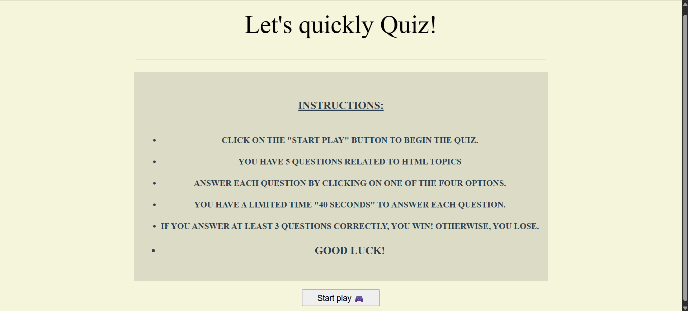
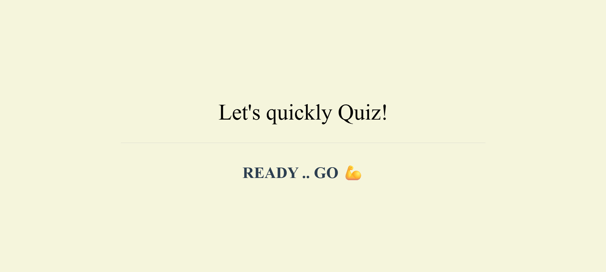
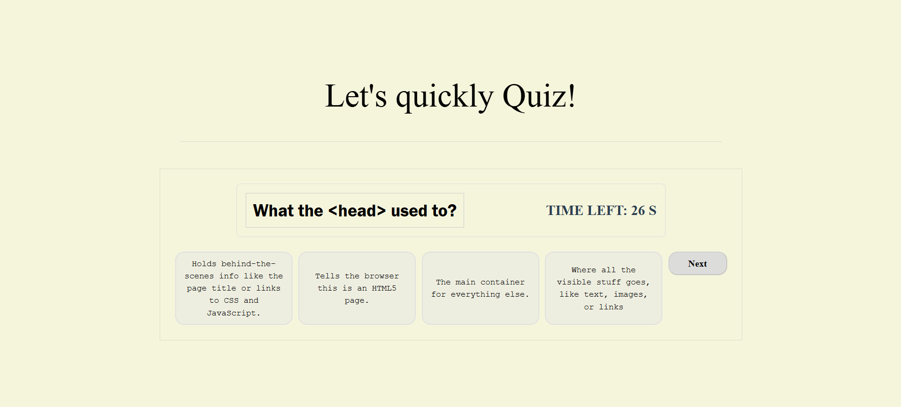
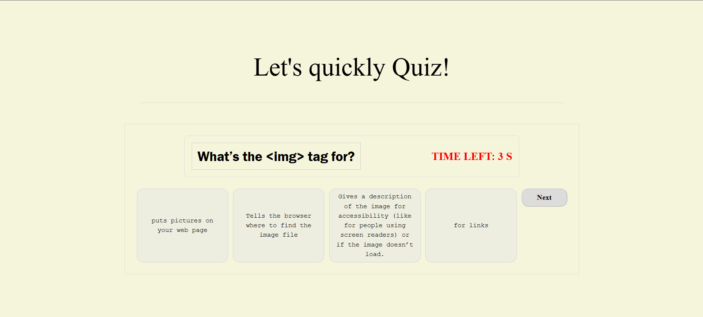
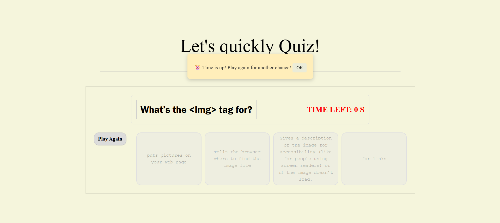
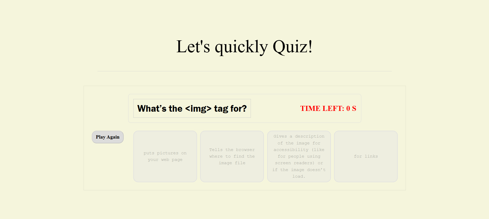

# Project Name
Lets quickly quiz.  
 [Play Now](https://fatimas508.github.io/firstProject-QuizG/)

## Technologies Used
1. HTML
2. CSS
3. JAVASCRIPT

## Description

Lets Quickly Quiz is browser‑based quick quiz game built with HTML, CSS, and JavaScript. It challenges players with timed multiple‑choice questions, combining speed and accuracy to create a fun learning experience. The project emphasizes clean UI design, responsive layouts for mobile devices, and strict anti‑cheat logic to ensure fair play.

### Features 
* Dynamic/interactive countdoun timer tracks your remaining time for each quession
* Win/lose logic: keeps real-time track of your score-players must answer at least 3 questions correctly to achieve vactory
* Anti-Cheat Lockout: Automatically disables answer selection the exact second time expires or when user submit, preventing late inputs.
* Immersive UI: A clean, engaging user interface designed to keep focus entirely on the game.

## User Stories

### 🎯 Core Gameplay
* *The player*, can click a clear "Start Play" button so that I can begin the quiz when I am ready.
* *The player*, can see one question displayed at a time so that he can focus on it without being overwhelmed by the whole quiz with multiple-choice options.
* *The player*, can see a live countdown timer on the screen so that he know exactly how much time he have left to answer.

### ⚠️ Feedback & Constraints
* *As a player*, he want the timer text to turn red when he have 10 seconds or less remaining so that he get a visual warning that time is running out.
* *As a player*, he want the answer buttons to lock and disable automatically if the timer hits zero or if he click "Submit" so that he cannot change my mind or cheat after time is up.

### 🏆 Winning & Losing
* *As a player*, he want to see a final score or win/loss message at the end of the game so that he know if he answered at least 3 questions correctly and won the game.

## Screenshots

## Future Enhancements

* Adding categories: CSS, javascript
* Enhance different levels (easy, intermedediate, hard)
* Let the player to write his name to welcoming him 

## Credits
* Mr.Omar Kamal - spececial and huge thanks to my instructor for providing the project promt, valuable code reviewsm and guidance.